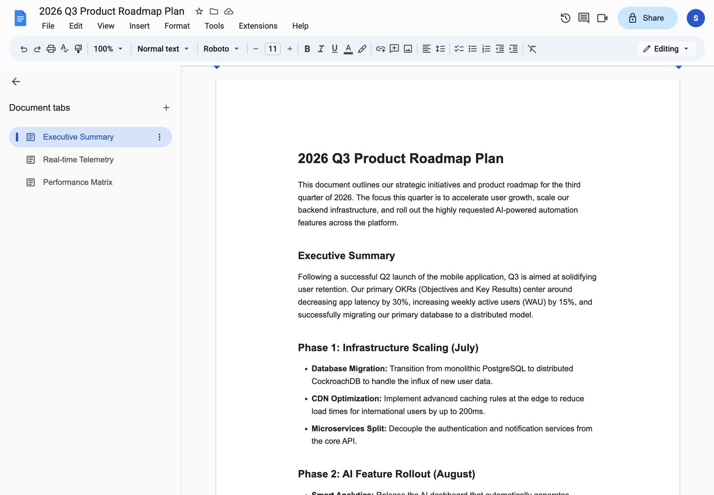

# Cric Scores

A real-time corporate cricket dashboard ingeniously disguised as a standard Google Docs document. Keep track of live cricket scores discreetly without raising any eyebrows!

## Features

- **Disguised UI**: The entire application looks and feels like a Google Docs document.
- **Live Match Data**: Fetches real-time cricket match updates.
- **Panic Mode**: Press `Escape` at any time to instantly hide the match data and display a fake "Executive Summary" to maintain the disguise.
- **Browser History**: Full support for browser back/forward navigation to browse matches seamlessly.

## Preview


## Local Instructions

Follow these steps to run the project locally on your machine.

### Prerequisites
- [Node.js](https://nodejs.org/) (v18 or higher recommended)
- npm or yarn

### Setup

1. **Clone the repository**:
   ```bash
   git clone <repository-url>
   cd cric-scores
   ```

2. **Install dependencies**:
   ```bash
   npm install
   ```

3. **Start the development server**:
   ```bash
   npm run dev
   ```

4. **Open in Browser**:
   Navigate to [http://localhost:5173](http://localhost:5173) in your browser to view the app.

### Available Scripts
- `npm run dev`: Starts the Vite development server.
- `npm run build`: Compiles TypeScript and builds the app for production.
- `npm run lint`: Runs ESLint to check for code issues.
- `npm run preview`: Previews the production build locally.
